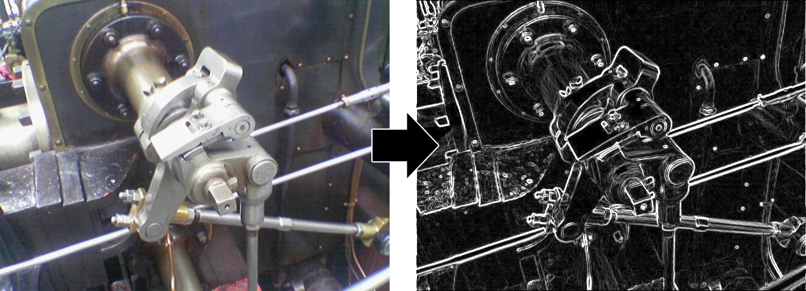

<h3 align="center">
  <br />
  
  <br />
  <br />
  <br />
</h3>

# sobel

> [Sobel Filter](https://en.wikipedia.org/wiki/Sobel_operator) algorithm in JavaScript.

[](https://raw.githubusercontent.com/miguelmota/sobel/master/LICENSE) [](https://travis-ci.org/miguelmota/sobel) [](https://david-dm.org/miguelmota/sobel) [](http://badge.fury.io/js/sobel)

Sobel Filter is an algorithm often used for [edge detection](https://en.wikipedia.org/wiki/Edge_detection).



[](https://nodei.co/npm/sobel)

## Demo

[https://lab.miguelmota.com/sobel](https://lab.miguelmota.com/sobel)

## Install

```bash
npm install sobel
```

## Getting started

```javascript
var canvas = document.getElementById('canvas');
var context = canvas.getContext('2d');

var image = new Image();
image.src = 'images/valve.png';
image.onload = drawImage;

function drawImage(event) {
  var width = image.width;
  var height = image.height;

  canvas.width = width;
  canvas.height = height;

  context.drawImage(image, 0, 0);
  var imageData = context.getImageData(0, 0, width, height);

  // Sobel constructor returns an Uint8ClampedArray with sobel data
  var sobelData = Sobel(imageData);

  // [sobelData].toImageData() returns a new ImageData object
  var sobelImageData = sobelData.toImageData();
  context.putImageData(sobelImageData, 0, 0);
}
```

Same example as above but using a [Web Worker](https://developer.mozilla.org/en-US/docs/Web/API/Web_Workers_API):

```javascript
var canvas = document.getElementById('canvas');
var context = canvas.getContext('2d');

var image = new Image();
image.src = 'images/valve.png';
image.onload = drawImage;

function drawImage(event) {
  var width = image.width;
  var height = image.height;

  canvas.width = width;
  canvas.height = height;

  context.drawImage(image, 0, 0);
  var imageData = context.getImageData(0, 0, width, height);

  var ww = new Worker('/webWorker.js');
  ww.postMessage(imageData);

  ww.onmessage = function(event) {
    var sobelData = event.data;

    // Sobel.toImageData() returns a new ImageData object
    var sobelImageData = Sobel.toImageData(sobelData, width, height);
    contextSobel.putImageData(sobelImageData, 0, 0);
  };
}
```

In `webWorker.js`:

```javascript
importScripts('/sobel.js');

self.onmessage = function(event) {
  // Sobel constructor returns an Uint8ClampedArray with sobel data
  var sobelData = Sobel(imageData);

  self.postMessage(sobelData);
};
```

## License

[MIT](LICENSE)
